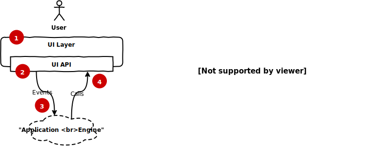
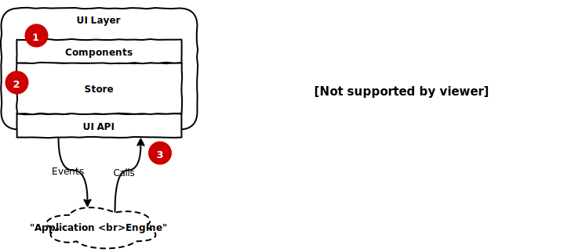

# Transmission (TX)

Transmission is an event driven variant of the Flux front end architecture. For a more academic treatment of the motivation and the principles behind this architecture, read the [whitepaper](./Transmission-TX-A-new-Flux-architecture.pdf). For a more practical guide, continue reading.

There is more than one way to think about *Transmission*. Here we will develop the thinking behind each layer of the architecture peacemeal.

### 1. UI is a dumb shell

UI layer is just a dumb, empty shell. It needs an "engine" to tell it what to do.

 

 

### 2. State variables must correpsond to things on screen

Every UI state variable must correspond directly to something visible on screen.

 

 

### 3. Design the UI layer API by examining the mock/wireframe

Consider this simple TODO app:

 

 

If you carefully think about every element and how it can interact with the end user, you will end up with a UI layer API like this.

Events fired by the UI layer:

- TODO_APP_LOADED
- TODO_INPUT_BOX_CHANGED
- ADD_TODO_BUTTON_CLICKED
- TODO_CHECKBOX_CLICKED
- TODO_DELETE_BUTTON_CLICKED

An "application engine" can listen to these events and use the following functions to manipulate the UI:

- updateTodoInputBox(text)
- updateTodoList(list)
- appendTodoToList(todo)
- updateTodo(todo)
- removeTodoFromList(id)

