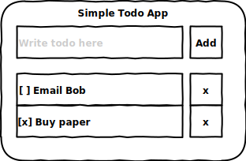

## Writing a React app with vanilla JS, view models and event emitters (no Redux)

Goal: low overhead, both for the JS runtime and the developer's brain.

Example:




```javascript
const Todos = require("todo-service");

class ToDoView extends React.Component { // container component
  constructor() {
    super();  // container component has only state, no props
    bindFunctionsStartingWith("on", this); // just a util function
    
    // state = WYSIWYG (variables are 1-to-1 modeling of what's seen on screen)
    // i.e. state = view model
    this.state = { 
      title: "Simple Todo App",
      todoInputBox: {                          
        placeholderText: "Write todo here",
        text: ""
      }
      todoInputButton: {
        enabled: false
      }
      todoList: [
        {
          id: 1,
          text: "Email Bob",
          completed: false 
        }
        {
          id: 2,
          text: "Buy paper",
          completed: true
        }
       ]
    };
  }
  
  render() {
    return (
      // component structure is a 1-to-1 modeling of what's seen on screen
      <TodoContainer title={this.state.title}> // sub components have only props, no state
        <TodoInputForm>
          <TodoInputBox placeholder={this.state.todoInputBox.placeholderText} onChange={this.onChangeInputBox} />
          <TodoAddButton text="+" onClick={this.onClickAddButton} />
          this.getTodoList().map(todo => <TodoRow completed={todo.completed} text={todo.text} />);
        </TodoInputForm>
      </TodoContainer>
    );
  }
  
  componentDidMount() { // instead of connecting to an immutable store, listen to business events
    Todos.addEventListener(this.onTodoEvent);
  }
  
  componentDidUnmount() { // don't receive events when unmounted
    Todos.removeEventListener(this.onTodoEvent);
  }
  
  //---------------------- Event Handlers --------------------------
  
  onChangeInputBox(e) {
    this.updateTodoInputBox(e.target.text); // overwrites what's already typed, with the same value, so that state is kept in sync
  }
  
  onClickAddButton(e) { // on UI event
    Todos.createTodo({ // call a business operation
      text: this.getTodoInputBoxText()
    }); // but don't wait on a promise; listen to the event instead (that way everyone gets the update, not just caller)
  }
  
  onTodoEvent(e) { // business events
    switch(e.type) {
      case TODO_CREATED: // on business event
        this.appendTodoRow({ // call a UI operation
          text: e.data.text,
          completed: e.data.completed
        });
      break;
    }
  }
  
  //------------- UI API ------------------------
  
  // state manipulation (therefore UI manipulation) API function
  appendTodoRow({text, completed}) {
    this.setState(state => {todoList: state.todoList.push({text, completed})});
  }
  
  updateTodoInputBox(text) {
    this.setState(state => { todoInputBox: {text} });
  }
  
  getTodoInputBoxText() {
    return this.state.todoInputBox.text;
  }
  
}
```
